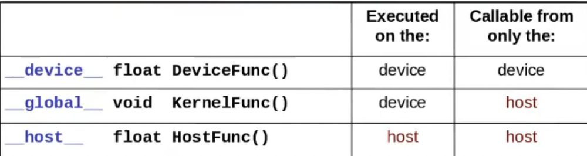

- __global__ defines a kernel must return void
- Host == CPU Device == GPU

CPU to GPU
```cudaHostAlloc(void** pHost,sizeof(int),0)```
- free ```cudaFreeHost()```
GPU to CPU
```cudaMemcpy ( void* dst, const void* src, size_t count, cudaMemcpyKind kind )```

### Basic GPU Programming
    - Computation, Memory, Synchronization, Debugging.
### Advanced GPU Programming
    - Streams, Heterogeneous computing, Case studies.
### Topics in GPU Programming
    - Unified virtual memory, multi-GPU, peer access