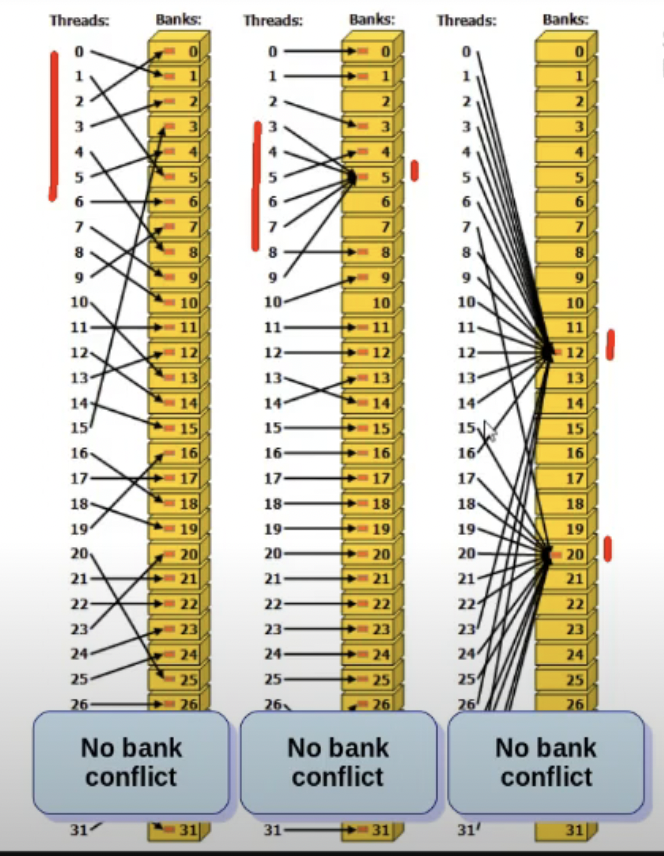

When the amount of shared memory is unknown at compile-time.
```
#include <stdio.h>
#include <cuda.h>

__global__ void dynshared(){
    `extern __shared__` int s[];
    s[threadIdx.x] = threadId.x;
    __syncthreads();

    if(threadx.x % 2) printf("%d\n",s[threadIdx.x]);
}
int main(){
    int n;
    scanf("%d",&n);
    dynshared<<<1,n,`n*sizeof(int)``>>>();
    cudaDeviceSynchronize();
    return 0;
}


```
### Bank Conflicts
- Shared memory is organized into banks
- Accesses to the same bank are sequential.
- Consecutive words are stored in agjacent banks
- ** Warp Accesses to the same word are not sequentialized. **
```
__global__ void bankNOconflict(){
    __shared__ unsigned s[1024];
    s[1 * threadIdx.x] = threadIdx.x;
}

```

```
__global__ void bankNOconflict(){
    __shared__ unsigned s[1024];
    s[32 * threadIdx.x] = threadIdx.x;
}

```



