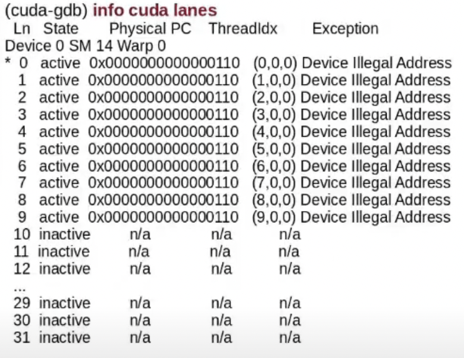

## Debugging
Debugging parallel programs is difficult:
- Non-determinism due to thread-scheduling
- Output can be different
- Correct intermediate values may be large

**cuda-gdb**
- debugging cuda programs on real hardware
- externsion to gdb
- allow breakpoints, single-step, real/write memory contents

```
cudaError err = cudaGetlastError();
printf("error=%d,%s,%s\n",err,cudaGetErrorName(err),cudaGetErrorString(err));
```


- Generate debug info
    - ```nvcc -g -G file.cu```
    - Disables optimizations, insert symbol information
- Run with cuda-gdb
    - ``` cuda-gdb a.out ```
    - ``` > run ```
- May have to stop windows manager
- Due to lots of threads, cuda-gdb works wit ha focus(current thread)


**CUDA-gdb run example**


**cuda output info**


- Breakpoints
    - ```break main``: first instruction in main
    - ```break file.cu:223``: file line
    - ```set cuda break_on_launch application``: kernel entry breakpoint
    - ``` break file.cu:23 if threadIdx.x == 1 && i <5```: conditional breakpoint
- Once at a breakpoint, you can single step
    - step, s or <enter>  
