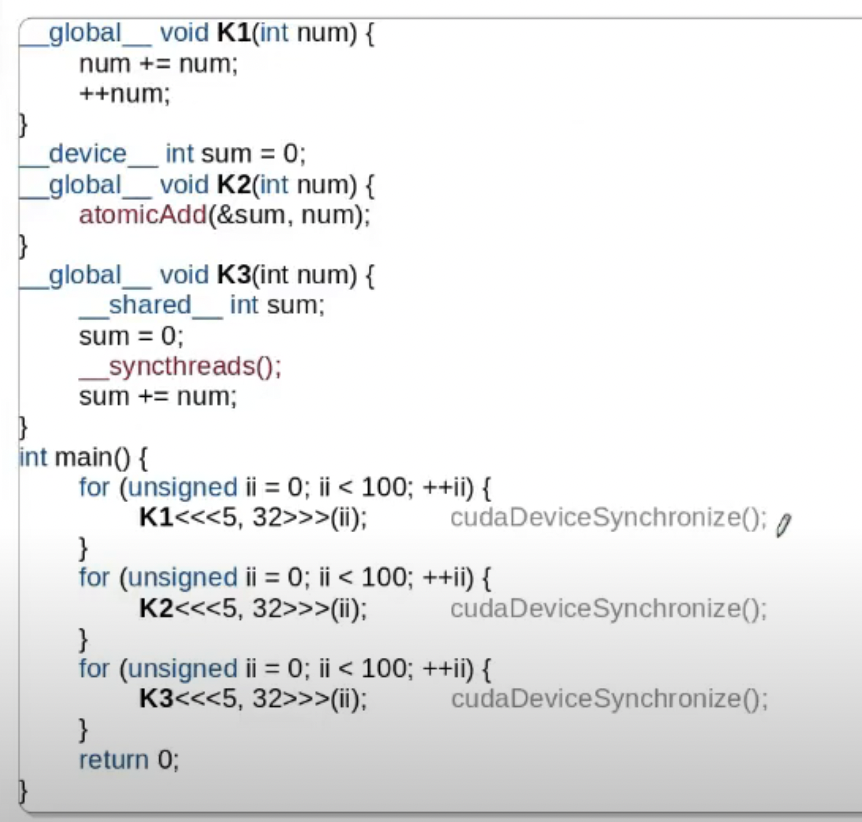
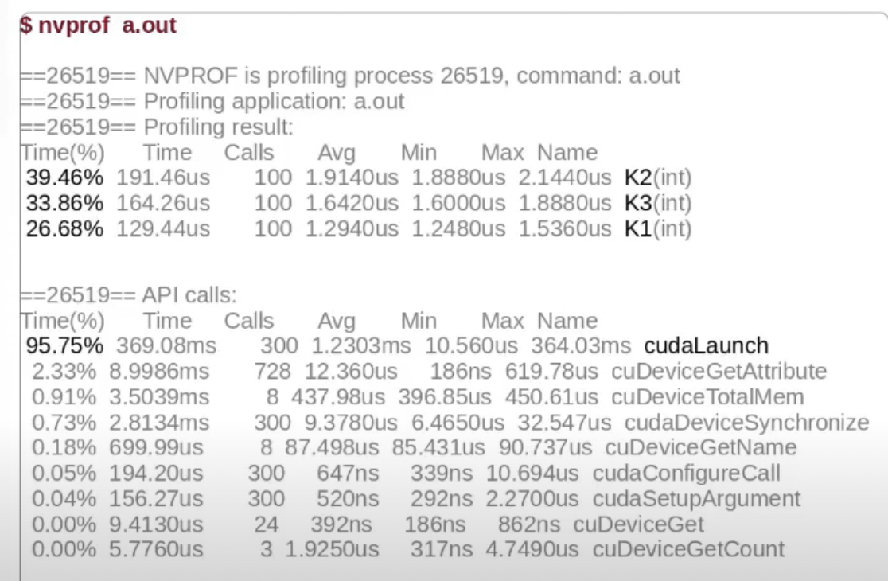
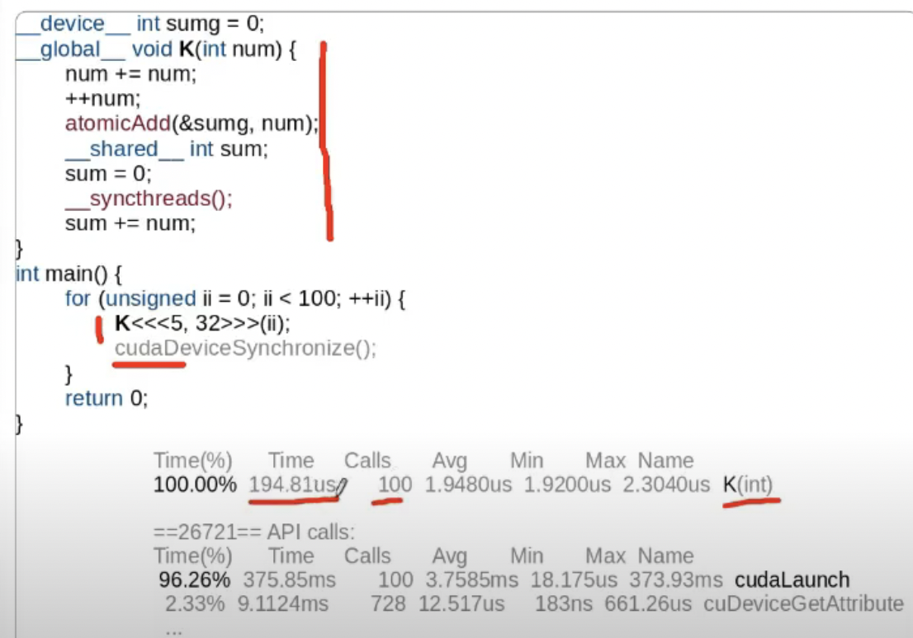
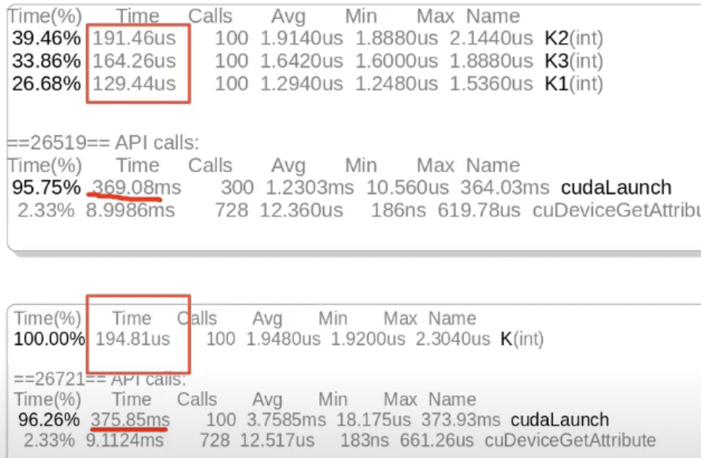

Measuring "indicators" of performance
- Time taken by various kernels
- Memory utilization
- Number of cache misses
- Degree of Divergence
- degree of coalescing

Intrusive vs non-intrusive

### CUDA Profiler
- nvprof: command line
- nvvp,nsight: Visual Profilers
An Event is a measuable activity on a device. It corresponds to a hardware counter value.

## nvprof
- No changes requied to the binary. Use defaults.
    - ``` nvprof a.out```
- To profile part if a program, use ```cudaProfilerStart()``` and ```cudaProfilerStop()```.
    - Include ```cuda_profiler_api.h```
    - ```nvprof ---profile-from-start off a.out```
    - Example 
    
    
    
    

    

    Compare:
    

- Conclusion
    - Supports device-specific profiling
    - Supports remote profiling
    - Output can be dumped to files as a csv file


