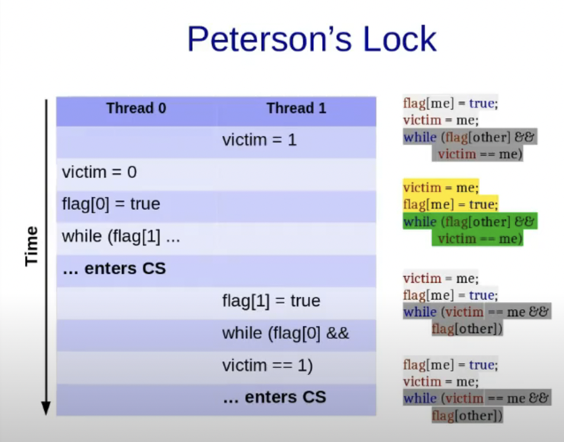

### Petersons Algorithm

## Implement mutual exclusion for two threads:

```
while(!flag):
S1;
```
```
S2;
flag = true;
```
init flag = false;

Allow either S1 or S2 to happen first:
```
while(!flag);
S1;
flag = false;

```
```
while (flag);
S2;
flag = true;
```
init flag = true/false
**assumptions**
- Reading of and writing to flag is atomic(seeming one step)
- Both the threads execute their codes
- flag is volatile

### Mutual Exclusion: 2 threads
- Mutual exclusion is guaranteed because each thread can only enter the critical section if either the other thread is not interested (flag[other] is false), or if the other thread has yielded (victim is not equal to its tid).
- ThreadIds are 0 and 1 (tid)
- Primitive type assignments are atomic

## Version 1
```
lock:
    me = tid;
    other = 1 - me;
    flag[me] = true;
    while(flag[other]);// it waits f the other thread also wants to enter the critical section.

```

```
unlock:
    flag[tid] = false;
//After exiting the critical section, the thread sets its flag value to false, indicating that it no longer needs to be in the critical section.
```

- Mutual exclusion is guaranteed (if volatile)
- May lead to deadlock
- If one thread runs before the other, all goes well

## Version 2
```
volatile int victim;
lock:
    me = tid;
    victim = me;
    while(victim == me);// it waits f the other thread also wants to enter the critical section.
    ;
```

```
unlock:
    ;
```
- Mutual exclusion is guaranteed (if volatile)
- May lead to starvation: Starvation can occur if one thread runs much more frequently than the other (due to scheduling, priority, etc.), and always sets `victim` to its `tid` before the other thread gets a chance to enter the critical section. In this case, the other thread could be starved and never get to execute its critical section.
- If threads repeatedly take locks, all goes well:  If threads repeatedly take locks and there's no significant difference in their execution frequency or timing, all goes well because each thread will get a fair chance to enter the critical section. This is because the `victim` variable will keep getting updated by each thread before it tries to enter the critical section, ensuring that no single thread can monopolize the critical section.

- When a thread (let’s call it Thread A) wants to enter the critical section, it sets victim to its own thread ID (tid). This indicates that Thread A is willing to “step back” for other threads and wait if necessary.
- If another thread (Thread B) also wants to enter the critical section around the same time, it will also set victim to its tid. If Thread B does this after Thread A sets victim, then victim will now hold the value of Thread B’s tid.
- Now, both threads will check the while(victim == me); condition. For Thread A, this condition will be true (because victim is now equal to Thread B’s tid), so it will enter the waiting loop. For Thread B, the condition will be false, so it will skip the loop and enter the critical section.
- After Thread B exits the critical section, Thread A can then enter. This is because the while(victim == me); loop only causes a thread to wait if victim is equal to its tid. Once Thread B has finished and if no other thread has set victim to its tid, Thread A will exit the loop and enter the critical section.

## Version 3
**Petersons Algorithm**

```
volatile bool flag[2];
volatile int victim;
lock:
    me = tid;
    other = 1 - me;
    flag[me] = true;// indicating that it wants to enter the critical section
    victim = me; // indicating that it is willing to wait if the other thread also wants to enter the critical section
    while(flag[other]&&victim == me)
    ;

```

```
unlock:
    flag[tid] = false;
```

- flag indicates if a thread is interested
- victim = me is "after you" gesture

- **Mutual exclusion is guaranteed**
- **Does not lead to deadlock:** The algorithm does not lead to deadlock because if both threads are interested, the one that sets victim to its tid last will yield to the other thread.
- **The algorithm is starvation-free**: Because a thread yields to the other thread if both are interested in entering the critical section. This ensures that both threads get a fair chance to enter the critical section.

