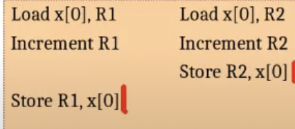

### Atomics
Atomics are primitive operations whose effects are visible eitehr non or fully (never partially)
- Need hardware support
- ``` atomicCAS atomicMin atomicAdd```
- work with both global and shared memory

Example:
```
__global__ void dkernel(int *x){
    ++x[0];
}
dkernel<<<1,2>>>(x);
```
```++x[0]``` is equivalent to:
```
Load x[0], R1
Increment R1
Store R1, x[0]
```
what if:


So...
```atomicInc(&x[0],N)```
dkernel<<<K1,K2>>> would ensure x[0] to be incremented by exactly K1*K2
- irrespective of the thread execution order

Do u remember this?
Compute the shortest paths
**Example**:
- Let's Compute the Shortest Paths You are given an input graph, and you want to compute the shortest path from Nagpur to every other city.
- Assume that you are given a GPU graph library and the associated routines.
- Each thread operates on a node and settles distances of the neighbors (Bellman-Ford style).

```
__global__ void dssp(Graph g, unsigned *dist){
    unsigned id = threadIdx.x;
    for each n in g.allneighbors(id){
        unsigned altdist = dist[id] + weight(id,n);
        if(altdist < dist[n]){
            <!-- dist[n] = altdist; -->
            atomicMin(&dist[n],altdist);
        }
    }
}
```

### Atomics Locks
## AtomicCAS
Syntax: oldval = atomicCAS(&var,x,y);
```if(var == x) var = y; old = x;```

Typical usecases:
- Locks: critical section processing
- Single: only one arbitrary thread executes the block

## Lock using AtomicCAS
```atomicCAS(&lockvar,0,1)``` Does not ensure mutual exclusion
```if(atomicCAS(&lockvar,0,1))``` Does not block other threads
```
do{
    old = atomicCAS(&lockvar,0,1);
}while (old != 0);

```


```#include <stdio.h> 
#include <cuda.h> 

__global__void k1(int *gg) { 
    int old = atomicCAS(gg, 0, threadldx.x +1); 
    if (oid == 0) { 
    printf( Thread %d succeeded 1.\n", threadldx.x); 
    }
    old = atomicCAS(gg, 0, threadldx.x+1); 
    if (old == 0) { 
    printf("Thread %d succeeded 2.\n", threadldx.x); 
    }
    old = atomicCAS(gg,threadldx.x. -1); 
    if (old == threadldx.x) {
    printf("Thread %d succeeded 3.\n", threadldx.x);
    }
}

int main(){
    int *gg;
    cudaMalloc(&gg,sizeof(int)); c
    udaMemset(&gg,0, sizeof(int)); 
    k1<<<2. 32>>>(gg);
    cudaDeviceSynchronize();
    return 0;
}```

- Some thread out of 64 updates gg to its threadid+1. 
- Warp threads do not execute atomics together! That is also done sequentially. 
- Irrespective of which thread executes the first atomicCAS, no thread would see gg to be 0.Hence second printf is not executed at all. 