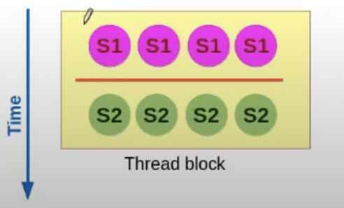

### Barriers
- A barrier is a program point where all threads need to reach before any thread can proceed.
- End of kernel is an implict barrier for all GPU threads. (**global barrier**)
- There is no explicit global barrier supported in CUDA.
- Threads in a thread-block can synchronize using ```_syncthreads()```

```
__global__ void dkernel(unsigned *vector, unsigned vectorsize){
    unsigned id = blockIdx.x * blockDimx + threadsIdx.x;
    vector[Id] = id;// S1
    __syncthreads();
    if(id < vectorsize - 1 && vector[id+1] != id + 1) // S2
        printf("syncthreads does not work");
}

```
Timeline:


Barriers:
- ``` _syncthreads()``` is not only about control synchronization, it also has data synchronization mechanism
- A memory fence ensures that the writes from a thread are made visible to other threads.
- ``` _syncthreads()``` executes a fence for all the block-threads
- ```__threadfence_block()```
- ```__threadfence()```
- **A fence does not ensure that other thread will read the update value**
    - This can happen due to caching
    - The other thread needs to use volatile data
- In CUDA a fence applies to both read and write