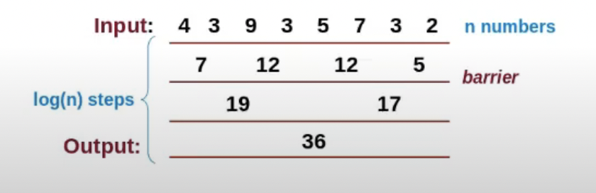
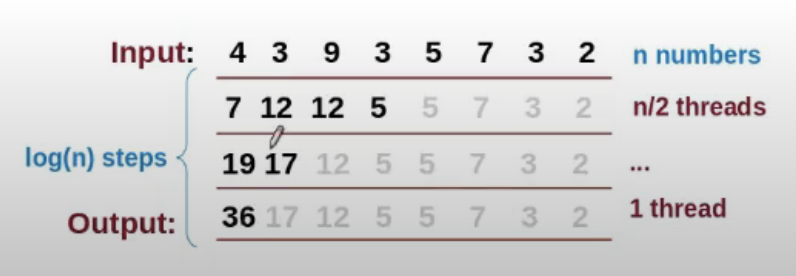

Converting a set of values to few values
Computation must be reducible
- (a(bc)) = ((ab)c)
- Min, Max, Sum, XOR

```
for(int off = n/2; off;off/=2){
    if(threadIdx.x < off){
        a[threadIdx.x] += a[threadIdx + off];
    }
    __syncthreads();
}

```


```
for(int off = n/2; off;off/=2){
    if(threadIdx.x < off){
        a[threadIdx.x] += a[ 2*off - threadIdx -1];
    }
    __syncthreads();
}

```

- a[1] is read by thread 0 and written by thread 1
- this is data race
- this requies anotehr barrier and a temporary