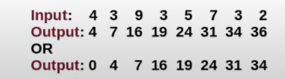
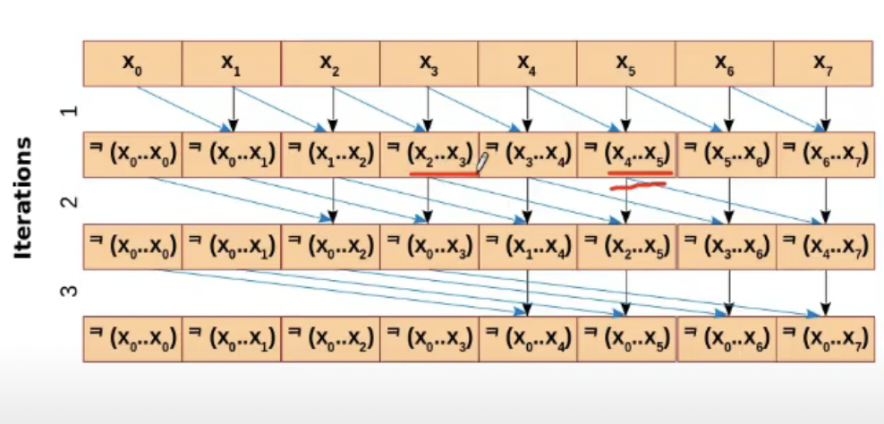

- Imagine threads wanting to push work items to a central worklist
- Each thread pushes different number of work items
- Also called scan


```
for(int off = n/2; off;off/=2){
    if(threadIdx.x < off){
        a[threadIdx.x] += a[ threadIdx + n - off];
    }
    __syncthreads();
}
```

OutPut: 4 7 16 19 23 31 33 35

```
for(int off = 0; off<n>;off8=2){
    if(threadIdx.x > off){
        a[threadIdx.x] += a[ threadIdx - off];
    }
    __syncthreads();
}

```
OutPut: 0 4 7 16 19 24 31 33


# Application of Prefix Sum
- cumulative sum
    - histogramming
    - area under the curve
    - fenwick tree (binary index tree)
- prefix sum kernel, insert elements into the worklist
    - each thread inserts nelem[tid] many elements
    - the order of elements is not important
    - forbidden to use atomics