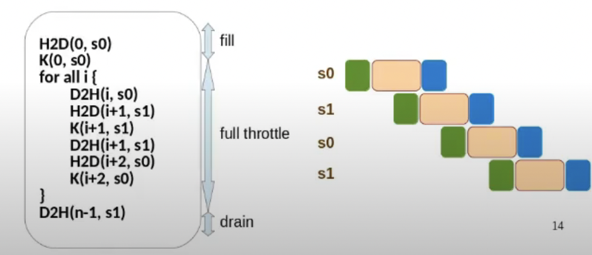

### Overlapped computation and Communication: N streams

- Number of streams maybe limited
```
H2D(0, s0) 
K(0, s0) 
for all i {
    D2H(i, s0) 
    H2D(i+1, s1) 
    K(i+1, s1) 
    D2H(i+1, s1) 
    H2D(i+2, s0) 
    K(i+2, s0) 
}
D2H(n-1, s1)
```


### Across Stream Sync
- Implement a global barrier across two kernels running in different streams.
    - Can there be a deadlock? Compare with resident blocks.

- Can there be a deadlock between two stream operations where:
    - one is a kernel and another is a memory transfer? 
    - two memory transfers are involved?